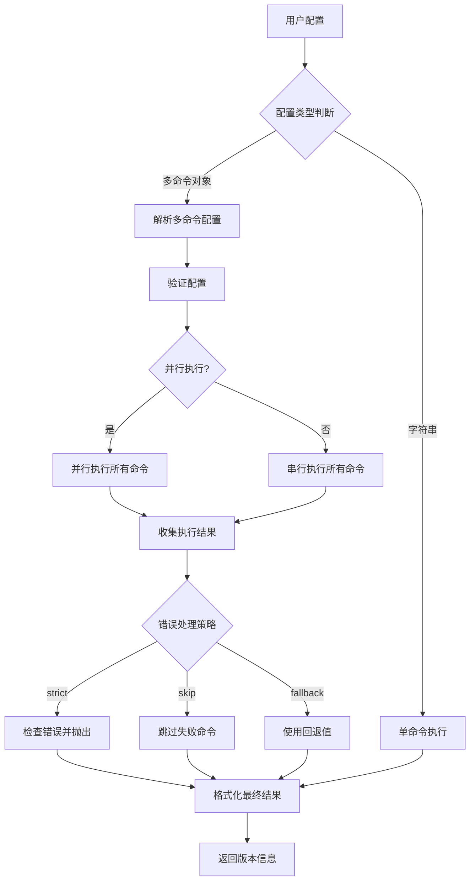

# Design Document

## Overview

本设计文档描述了如何扩展 vite-plugin-version-mark 的 command 参数，使其支持多个命令的组合执行。设计将保持完全的向后兼容性，同时提供灵活的多命令配置和结果格式化功能。

## Architecture

### 核心设计原则

1. **向后兼容**：现有的字符串 command 配置保持不变
2. **类型安全**：使用 TypeScript 提供完整的类型支持
3. **灵活配置**：支持多种配置方式和格式化选项
4. **错误处理**：提供多种错误处理策略
5. **性能优化**：并行执行命令以提高性能

### 类型定义扩展

```typescript
// 单个命令配置
interface CommandConfig {
  alias: string;           // 命令别名，用于模板引用
  cmd: string;            // 实际执行的命令
  fallback?: string;      // 命令失败时的回退值
  timeout?: number;       // 命令超时时间（毫秒）
}

// 多命令配置选项
interface MultiCommandOptions {
  commands: (string | CommandConfig)[];  // 命令列表
  format?: string;                       // 格式模板，如 "{branch}-{sha}"
  separator?: string;                    // 默认分隔符（当未提供格式时）
  errorStrategy?: 'strict' | 'skip' | 'fallback';  // 错误处理策略
  parallel?: boolean;                    // 是否并行执行命令
}

// 扩展现有的输入类型
interface VitePluginVersionMarkCommandInput extends VitePluginVersionMarkBaseInput {
  command?: string | MultiCommandOptions;  // 支持字符串或多命令配置
}
```

## Components and Interfaces

### 1. Command Executor (命令执行器)

负责执行单个或多个命令，处理错误和超时。

```typescript
interface CommandExecutor {
  // 执行单个命令（现有逻辑）
  execSingleCommand(command: string, timeout?: number): Promise<string>;
  
  // 执行多个命令
  execMultipleCommands(
    commands: (string | CommandConfig)[], 
    options: { parallel?: boolean; errorStrategy?: string }
  ): Promise<Map<string, string>>;
}
```

### 2. Result Formatter (结果格式化器)

负责将多个命令的结果按照指定格式组合。

```typescript
interface ResultFormatter {
  // 格式化多个命令结果
  format(
    results: Map<string, string>, 
    template?: string, 
    separator?: string
  ): string;
  
  // 解析格式模板中的占位符
  parseTemplate(template: string): string[];
}
```

### 3. Configuration Parser (配置解析器)

负责解析和验证用户配置。

```typescript
interface ConfigurationParser {
  // 解析命令配置
  parseCommandConfig(command: string | MultiCommandOptions): {
    isSingle: boolean;
    commands: CommandConfig[];
    options: MultiCommandOptions;
  };
  
  // 验证配置有效性
  validateConfig(config: any): boolean;
}
```

## Data Models

### CommandResult

```typescript
interface CommandResult {
  alias: string;        // 命令别名
  command: string;      // 原始命令
  result?: string;      // 执行结果
  error?: Error;        // 错误信息
  duration: number;     // 执行时间
  success: boolean;     // 是否成功
}
```

### ExecutionContext

```typescript
interface ExecutionContext {
  commands: CommandConfig[];
  options: MultiCommandOptions;
  results: Map<string, CommandResult>;
  finalVersion: string;
}
```

## Error Handling

### 错误处理策略

1. **strict 模式**：任何命令失败都会抛出错误，停止构建
2. **skip 模式**：跳过失败的命令，继续处理其他命令
3. **fallback 模式**：使用预设的回退值替代失败命令的结果

### 错误类型

```typescript
class MultiCommandError extends Error {
  constructor(
    message: string,
    public failedCommands: CommandResult[],
    public successCommands: CommandResult[]
  ) {
    super(message);
  }
}
```

## Testing Strategy

### 单元测试

1. **CommandExecutor 测试**
   - 单个命令执行
   - 多个命令并行/串行执行
   - 超时处理
   - 错误处理

2. **ResultFormatter 测试**
   - 模板解析
   - 结果格式化
   - 占位符替换
   - 默认分隔符处理

3. **ConfigurationParser 测试**
   - 配置解析
   - 类型验证
   - 向后兼容性

### 集成测试

1. **完整流程测试**
   - 不同配置组合的端到端测试
   - 与现有功能的集成测试
   - 构建过程中的实际使用测试

2. **兼容性测试**
   - 现有字符串配置的兼容性
   - 不同 git 环境的兼容性
   - 不同操作系统的兼容性

## Implementation Details

### 核心实现流程



### 配置示例

```typescript
// 示例 1: 向后兼容的字符串配置
{
  command: 'git describe --tags'
}

// 示例 2: 简单的多命令数组
{
  command: {
    commands: [
      'git rev-parse --abbrev-ref HEAD',
      'git rev-parse --short HEAD'
    ],
    separator: '-'  // 输出: "main-abc1234"
  }
}

// 示例 3: 完整的多命令配置
{
  command: {
    commands: [
      { alias: 'branch', cmd: 'git rev-parse --abbrev-ref HEAD', fallback: 'unknown' },
      { alias: 'sha', cmd: 'git rev-parse --short HEAD', timeout: 5000 },
      { alias: 'tag', cmd: 'git describe --tags --abbrev=0', fallback: 'v0.0.0' }
    ],
    format: '{tag}-{branch}-{sha}',
    errorStrategy: 'fallback',
    parallel: true
  }
}
```

### 性能考虑

1. **并行执行**：默认并行执行多个命令以提高性能
2. **缓存机制**：在同一构建过程中缓存命令执行结果
3. **超时控制**：为每个命令设置合理的超时时间
4. **资源管理**：限制并发执行的命令数量

### 向后兼容性保证

1. **类型兼容**：`command?: string | MultiCommandOptions` 保持字符串类型支持
2. **行为兼容**：字符串配置的执行逻辑保持不变
3. **优先级兼容**：保持现有的版本字段优先级规则
4. **API 兼容**：不改变现有的公共 API 接口