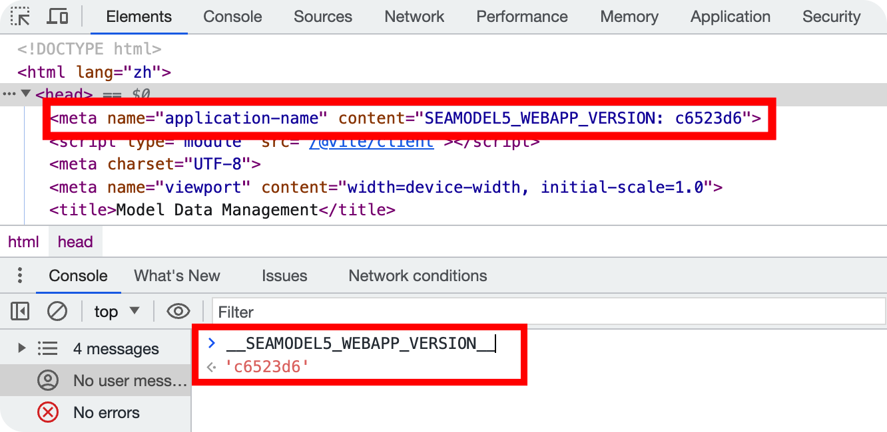

# vite-plugin-version-mark

> Automatically insert the version or git_commit_sha in your Vite/Nuxt project.

<div align="center">
  <a href="https://github.com/ZhongxuYang/vite-plugin-version-mark/tree/main">
    
  </a>
</div>

<div align="center">

[![npm version][npm-version-src]][npm-version-href]
[![npm downloads][npm-downloads-src]][npm-downloads-href]
[![types][types-src]][types-href]
[![License][license-src]][license-href]

[![Vite][vite-src]][vite-href]
[![Nuxt][nuxt-src]][nuxt-href]

[![Awesome][awesome-src]][awesome-href]

</div>

## Demo


## Install
```sh
yarn add -D vite-plugin-version-mark
# OR npm install -D vite-plugin-version-mark
```

## Usage
### Vite
```ts
// vite.config.ts
import {defineConfig} from 'vite'
import {vitePluginVersionMark} from 'vite-plugin-version-mark'

export default defineConfig({
  plugins: [
    vitePluginVersionMark({
      // name: 'test-app',
      // version: '0.0.1',
      ifGitSHA: true,
      ifShortSHA: true,
      ifMeta: true,
      ifLog: true,
      ifGlobal: true,
    })
  ],
})
```

### Nuxt3+
```ts
// nuxt.config.ts
export default defineNuxtConfig({
  modules: [
    ['vite-plugin-version-mark/nuxt', {
      ifGitSHA: true, 
      ifShortSHA: true, 
      ifMeta: true, 
      ifLog: true, 
      ifGlobal: true 
    }]
  ],
})
```

## Config

`vite-plugin-version-mark` can be print application version in the `Console` or add `<meta>` in HTML element.

- `name` - application name (`name in package.json` by default)
- `version` - application version (`version in package.json` by default)
- `ifGitSHA` - use git commit SHA as the version (`false` by default)
- `ifShortSHA` - use git commit short SHA (`true` by default)
- `ifMeta` - add \<meta name="application-name" content="{APPNAME_VERSION}: {version}"> in the \<head> (`true` by default)
- `ifLog` - print info in the Console (`true` by default)
- `ifGlobal` - set a variable named *\`\_\_${APPNAME}\_VERSION\_\_\`* in the window. (`true` by default)

Then you can use `vite-plugin-version-mark` ! 🎉

<!-- Badges -->
[npm-version-src]: https://img.shields.io/npm/v/vite-plugin-version-mark/latest.svg?style=flat&colorA=18181B
[npm-version-href]: https://npmjs.com/package/vite-plugin-version-mark

[npm-downloads-src]: https://img.shields.io/npm/dm/vite-plugin-version-mark.svg?style=flat&colorA=18181B
[npm-downloads-href]: https://npmjs.com/package/vite-plugin-version-mark

[types-src]: https://img.shields.io/npm/types/vite-plugin-version-mark.svg?style=flat&colorA=18181B
[types-href]: https://npmjs.com/package/vite-plugin-version-mark

[license-src]: https://img.shields.io/npm/l/vite-plugin-version-mark.svg?style=flat&colorA=18181B
[license-href]: https://npmjs.com/package/vite-plugin-version-mark

[nuxt-src]: https://img.shields.io/badge/Nuxt-18181B?&logo=nuxt.js
[nuxt-href]: https://nuxt.com

[vite-src]: https://img.shields.io/badge/Vite-18181B?&logo=vite
[vite-href]: https://vitejs.dev

[awesome-src]: https://awesome.re/mentioned-badge.svg
[awesome-href]: https://github.com/vitejs/awesome-vite#transformers
